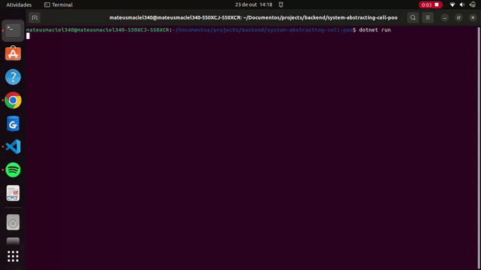

# System Abstracting Cell POO

<p align="center">
    
</p>

## Objective:

In this LAB you will be responsible for modeling a system that works with cell phones. For this, you were asked to make an abstraction of a cell phone and provide ways for different brands and models to have their own behavior, enabling greater code reuse.

## Result:



Video result can be seen on my linkedin - publications:

[mateusmaciel340](https://www.linkedin.com/in/mateusmaciel340/)

## Running:

```bash
dotnet build
```

```bash
dotnet run
```

## Tecnologies:

- C#

## Contributors

<table>
    <thead>
        <tr>
            <td>
                
            </td>
        </tr>
    </thead>
    <tbody>
        <tr>
            <th>Mateus Maciel</th>
        </tr>
    </tbody>
</table>

## How to contribute?

1. Fork the project.
2. Create a new branch with your changes: `git checkout -b my-feature`
3. Save the changes and create a commit message telling what you did: `git commit -m Modifying this [...]`
4. Submit your changes: `git push origin my-feature`

## License

This project is under license [MIT](https://github.com/git/git-scm.com/blob/main/MIT-LICENSE.txt).